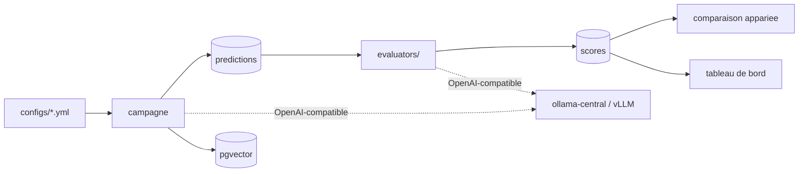

# ragbench — banc d'évaluation RAG on-premise

**Comparer des configurations RAG entre elles, sur des chiffres qu'on a le droit de
croire.** Matrice de configurations × jeu de questions × frameworks d'évaluation,
100 % local : aucun appel à un service externe.


> Documentation détaillée à venir. Ce README couvre l'essentiel pour démarrer.

## Le problème

Évaluer un RAG, ce n'est pas produire un score. C'est pouvoir répondre à
« cette modification a-t-elle amélioré quelque chose, et où ça casse-t-il ? »
Trois exigences en découlent, et elles structurent tout le projet :

1. **Attribuer la faute.** Un score global ne dit pas s'il faut changer le
   retriever ou le prompt. Le banc mesure les trois étages séparément
   (retrieval, génération, bout en bout) et sait dire lequel est en cause.
2. **Trancher statistiquement.** Sur 200 questions, deux points d'écart sont du
   bruit. Toute comparaison passe par un test **apparié** avec intervalle de
   confiance, jamais par deux moyennes mises côte à côte.
3. **Se méfier des juges.** Un juge LLM non confronté à un humain ne produit pas
   une métrique, il produit une opinion. Le banc fournit un écran d'annotation
   et calcule le κ de Cohen entre juge et humain.

## Architecture

Tout passe par une **API OpenAI-compatible**. C'est la décision qui porte le
reste : Ollama et vLLM l'exposent tous deux, et tous les frameworks
d'évaluation acceptent un `base_url` custom. Un seul point d'entrée suffit donc
pour brancher n'importe quel framework sur n'importe quel moteur, sans
adaptateur maison et sans appel externe.



Deux identités distinctes, et la distinction fait gagner des heures de GPU :

- `hash()` — identité d'une configuration complète. Deux runs de même hash sont
  comparables, les autres non.
- `index_hash()` — identité de l'index de corpus, fonction du seul couple
  (chunking, embedder). Comparer `top_k=5` et `top_k=10` **ne réindexe pas** les
  609 documents. Une matrice de 8 configurations ne construit que 2 index.

## Démarrage

Prérequis : `make up` dans `~/mes_projets/llm-service` — c'est lui qui fournit
l'Ollama central et le réseau Docker `llm-net`.

```bash
docker compose up -d db
uv sync --extra ui
cp .env.example .env
uv run ragbench db init
uv run ragbench doctor
```

Puis une première campagne :

```bash
curl -sSL -o data/raw/corpus.json https://huggingface.co/datasets/yixuantt/MultiHopRAG/resolve/main/corpus.json
curl -sSL -o data/raw/MultiHopRAG.json https://huggingface.co/datasets/yixuantt/MultiHopRAG/resolve/main/MultiHopRAG.json
uv run ragbench dataset load multihop-rag --sample 200
uv run ragbench run configs/baseline.yml --dataset multihop-rag
uv run ragbench eval run 1
```

Tableau de bord : `docker compose up -d ui` puis <http://localhost:8502>.

## Commandes

| Commande | Rôle |
|---|---|
| `ragbench doctor` | Postgres, pgvector et modèles disponibles — à lancer avant toute campagne |
| `ragbench dataset load <nom> --sample N` | Charge un corpus, échantillon stratifié déterministe |
| `ragbench config matrix <fichier>` | Développe une matrice et annonce combien d'index seront construits |
| `ragbench run <config> [--matrix]` | Exécute une campagne |
| `ragbench eval run <id> -e <évaluateur>` | Applique des évaluateurs à un run existant |
| `ragbench show <id>` | Métriques d'un run avec intervalles de confiance |
| `ragbench compare <A> <B>` | Test apparié entre deux runs |
| `ragbench leaderboard` | Classement des runs sur une métrique |

## Corpus

**MultiHop-RAG** (609 articles, 2 556 questions) est le corpus principal, choisi
parce qu'il porte les **passages de référence** de chaque question — les
métriques de retrieval sont donc calculables sans juge LLM — et parce qu'il
contient **301 questions délibérément sans réponse**, ce qui permet de mesurer
le *negative rejection*.

**HotpotQA** est présent au format très différent, pour vérifier que la couche
dataset est réellement pluggable. Brancher un corpus à soi revient à écrire une
fonction qui renvoie un `LoadedDataset` — rien d'autre ne change.

## Évaluateurs

| Plugin | Apport propre | Coût |
|---|---|---|
| `native.ir` | recall@k, nDCG@k, MRR au niveau document | gratuit, déterministe |
| `native.answer` | exact match, containment, negative rejection, accuracy par type | gratuit, déterministe |
| `native.nuggets` | couverture des faits de référence par les passages remontés | gratuit en mode lexical |
| `native.erag` | utilité réelle de chaque passage (Salemi & Zamani, SIGIR 2024) | `top_k` appels/question |
| `native.claims` | attribution de l'erreur : générateur ou retriever ? | plusieurs appels/question |
| `ragas` | les 4 métriques canoniques, avec taux de couverture | extra `--extra ragas` |
| `deepeval` | seuils pass/fail, donc non-régression en CI | extra `--extra deepeval` |

Un framework absent apparaît dans `ragbench eval list` avec sa raison, il ne
casse pas le banc : leurs contraintes de version entrent régulièrement en
conflit entre elles.

## Tests

```bash
uv run pytest -m "not regression"
```

Les tests marqués `regression` lisent la base et vérifient des planchers de
qualité sur le dernier run évalué. Ils portent sur la **borne basse** de
l'intervalle de confiance, pour échouer quand une régression est établie et non
quand le tirage a été défavorable.
