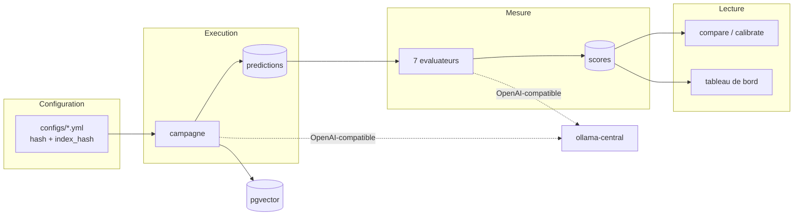

# ragbench

**Banc d'évaluation RAG on-premise : comparer des configurations entre elles sur des chiffres qu'on a le droit de croire.**


## Sommaire

- [Ce que fait le projet](#ce-que-fait-le-projet)
- [Architecture](#architecture)
- [Démarrage](#démarrage)
- [Configuration](#configuration)
- [Commandes](#commandes)
- [Résultats de référence](#résultats-de-référence)
- [Tests](#tests)
- [Structure du projet](#structure-du-projet)
- [Dépannage](#dépannage)
- [Licences & composants](#licences--composants)
- [Documentation détaillée](#documentation-détaillée)

---

## Ce que fait le projet

Évaluer un RAG, ce n'est pas produire un score. C'est pouvoir répondre à « cette
modification a-t-elle amélioré quelque chose, et où ça casse-t-il ? » Trois exigences en
découlent, et elles structurent tout le projet.

1. **Attribuer la faute.** Un score global ne dit pas s'il faut changer le retriever ou
   le prompt. Le banc mesure les trois étages séparément — retrieval, génération, bout
   en bout — et sait dire lequel est en cause.
2. **Trancher statistiquement.** Sur 200 questions, deux points d'écart sont du bruit.
   Toute comparaison passe par un test **apparié** avec intervalle de confiance, jamais
   par deux moyennes mises côte à côte.
3. **Se méfier des juges.** Un juge LLM non confronté à une référence ne produit pas une
   métrique, il produit une opinion. Le banc le calibre contre la vérité terrain et
   publie son κ de Cohen.

Tout fonctionne **sans aucun appel réseau sortant** : corpus local, modèles servis par
l'Ollama central du dépôt `llm-service`.

---

## Architecture

| Composant | Rôle |
|---|---|
| `configs/*.yml` | Configurations de pipeline et matrices d'expérience, versionnées |
| `src/ragbench/rag/` | Le pipeline **évalué** : découpage, recherche, génération |
| `src/ragbench/evaluators/` | Les sept évaluateurs, dont cinq déterministes |
| `src/ragbench/runner/` | Exécution des campagnes, comparaison, calibration |
| `src/ragbench/ui/` | Tableau de bord Streamlit |
| PostgreSQL + pgvector | Corpus, embeddings, runs, prédictions, scores, annotations |
| `ollama-central` | Serveur d'inférence, externe au projet |

Tout passe par une **API OpenAI-compatible**. C'est la décision qui porte le reste :
Ollama et vLLM l'exposent tous deux, et tous les frameworks d'évaluation acceptent un
`base_url` custom. Un seul point d'entrée suffit donc pour brancher n'importe quel
framework sur n'importe quel moteur.



Deux identités distinctes, et la distinction fait gagner des heures de GPU :

- `hash()` — identité d'une configuration complète. Deux runs de même hash sont
  comparables, les autres non.
- `index_hash()` — identité de l'index de corpus, fonction du seul couple
  (découpage, embedder). Comparer `top_k=5` et `top_k=10` **ne réindexe pas** les
  609 documents. Une matrice de 8 configurations ne construit que **2 index**.

Détail complet dans [docs/ARCHITECTURE.md](docs/ARCHITECTURE.md).

---

## Démarrage

**Prérequis** : `make up` dans `~/mes_projets/llm-service` — c'est lui qui fournit
l'Ollama central et le réseau Docker `llm-net`. Modèles attendus : `gemma4:e4b`,
`nomic-embed-text`, `llama3.2:3b`.

```bash
docker compose up -d db
uv sync --extra ui
cp .env.example .env
uv run ragbench db init
uv run ragbench doctor
```

`doctor` doit afficher Postgres, l'extension `vector` et la liste des modèles. Le lancer
avant toute campagne : découvrir à la question 400 qu'un modèle manque coûte une heure
de GPU.

Première campagne :

```bash
mkdir -p data/raw
curl -sSL -o data/raw/corpus.json https://huggingface.co/datasets/yixuantt/MultiHopRAG/resolve/main/corpus.json
curl -sSL -o data/raw/MultiHopRAG.json https://huggingface.co/datasets/yixuantt/MultiHopRAG/resolve/main/MultiHopRAG.json
uv run ragbench dataset load multihop-rag --sample 200
uv run ragbench run configs/baseline.yml --dataset multihop-rag
uv run ragbench eval run 1
```

| Accès | URL | Lancement |
|---|---|---|
| Tableau de bord | <http://localhost:8502> | `docker compose up -d ui` |
| PostgreSQL | `localhost:5432` | `docker compose up -d db` |
| Ollama central | <http://localhost:11434> | `make up` dans `llm-service` |

---

## Configuration

Deux niveaux, et la distinction est structurante : ce qui est dans `.env` ne doit
**jamais** changer un résultat d'évaluation ; ce qui change un résultat vit dans
`configs/*.yml` et entre dans le hash de la configuration.

### Infrastructure — `.env`

| Variable | Défaut | Effet |
|---|---|---|
| `DB_HOST` | `localhost` | Hôte PostgreSQL. `db` depuis un conteneur |
| `DB_PORT` | `5432` | Port PostgreSQL |
| `DB_USER` / `DB_PASSWORD` | `postgres` / `postgres` | Identifiants. À changer hors usage local |
| `DB_NAME` | `ragbench` | Base cible, créée par `ragbench db init` |
| `LLM_BASE_URL` | `http://localhost:11434/v1` | Endpoint OpenAI-compatible. `http://ollama-central:11434/v1` dans `llm-net` |
| `LLM_API_KEY` | `ollama` | Jeton factice, ignoré par Ollama |
| `LLM_CONCURRENCY` | `4` | Appels LLM simultanés. À aligner sur `OLLAMA_NUM_PARALLEL` : demander plus ne fait que remplir la file du serveur |
| `LLM_TIMEOUT_S` | `180` | Délai d'expiration par appel |
| `LLM_MAX_RETRIES` | `3` | Tentatives avant échec, avec repli exponentiel |

### Pipeline — `configs/*.yml`

Extrait de [configs/baseline.yml](configs/baseline.yml) ; chaque champ est documenté
dans [config.py](src/ragbench/config.py).

| Section | Paramètres clés |
|---|---|
| `chunking` | `strategy`, `chunk_size` (en **caractères**), `chunk_overlap`, `header_fields`, `header_scope` |
| `retrieval` | `mode` (`dense`/`lexical`/`hybrid`), `top_k`, `fetch_k`, `max_per_document`, `rerank`, `query_rewrite` |
| `generation` | `prompt_template`, `temperature`, `max_tokens`, `allow_abstain`, `thinking` |
| `models` | `generator`, `embedder`, `judge`, `verifier` |

Une matrice d'expérience déclare une `base` et des `variants` fusionnés en profondeur :

```bash
uv run ragbench config matrix configs/experiments/retrieval.yml
uv run ragbench run configs/experiments/retrieval.yml --matrix --dataset multihop-rag
```

---

## Commandes

| Commande | Rôle |
|---|---|
| `ragbench doctor` | Postgres, pgvector et modèles disponibles |
| `ragbench db init` / `db stats` | Créer le schéma / compter le contenu |
| `ragbench dataset list` / `dataset load <nom> --sample N` | Corpus disponibles / charger avec échantillon stratifié |
| `ragbench config show <fichier>` / `config matrix <fichier>` | Hash et avertissements / développer une matrice |
| `ragbench index <config> --dataset <nom>` | Construire l'index de corpus |
| `ragbench run <config> [--matrix]` | Exécuter une campagne |
| `ragbench diagnose recall-curve <config>` | Couverture des faits selon le nombre de passages, sans génération : le plafond vient-il de la recherche ou de `top_k` ? |
| `ragbench diagnose compare <A> <B>` | Verdict apparié sur la recherche seule, corrigé par Holm, avec la latence. `<config>` accepte `fichier.yml:variante` |
| `ragbench eval list` / `eval run <id> -e <évaluateur>` | Évaluateurs disponibles / noter un run |
| `ragbench show <id>` | Métriques d'un run avec intervalles de confiance |
| `ragbench compare <A> <B>` | Test apparié entre deux runs |
| `ragbench report [runs…]` | Tableau comparatif multi-runs |
| `ragbench calibrate <id>` | Confronter les juges à la vérité terrain (κ de Cohen) |
| `ragbench leaderboard` | Classement des runs sur une métrique |

Options utiles de `eval run` : `-o max_samples=40` pour borner le coût,
`-o judge=llama3.2:3b` pour rejuger un run existant avec un autre juge (les scores sont
alors stockés sous `évaluateur@juge`).

---

## Résultats de référence

MultiHop-RAG, 200 questions stratifiées, `gemma4:e4b` + `nomic-embed-text`. Détail et
méthode dans [docs/METHODOLOGIE.md](docs/METHODOLOGIE.md).

| Question | Réponse | Statut |
|---|---|---|
| Quel mode de recherche ? | **Hybride RRF** : recall@3 +0.098 vs dense | p < 0.001 |
| Le dense bat-il le lexical ? | **Non** — le lexical le bat de +0.062 | p = 0.010 |
| Le reranking LLM paie-t-il ? | **Non** : −0.001, pour 5× le coût | p = 0.959 |
| L'en-tête contextuel sert-il ? | **Oui** : +0.102 de justesse | p < 0.001 |
| Quel prompt ? | **`decompose`** : +0.096, sans perdre l'abstention | p = 0.001 |
| Le RAG bat-il le modèle seul ? | **Non démontrable** : IC95 [−0.034, +0.107] | p = 0.425 |

Le diagnostic de fond : `nugget_full_coverage = 0.0395`. Sur **4 % des questions
seulement**, tous les faits nécessaires sont présents dans les passages remontés. Régler
le prompt ne servira à rien tant que la couverture factuelle est à ce niveau.

---

## Tests

```bash
uv run pytest -m "not regression"
```

**84 tests** unitaires, sans base ni GPU. Ils portent prioritairement sur ce qui échoue
en silence : un appariement positionnel qui permute des scores ne change aucune moyenne
agrégée, un découpage qui perd du texte ne lève aucune erreur.

```bash
RAGBENCH_BASELINE_RUN=18 uv run pytest tests/test_regression.py
```

**7 tests** de non-régression, lus depuis la base. Les assertions portent sur la **borne
basse** de l'intervalle de confiance, pour échouer quand une régression est établie et
non quand le tirage a été défavorable. Ignorés si aucune campagne n'a tourné.

---

## Structure du projet

```text
.
├── configs/                       # configurations et matrices d'expérience (versionnées)
│   ├── baseline.yml               #   référence
│   └── experiments/               #   retrieval, generation, abstention
├── docker/Dockerfile              # image unique : ui et runner
├── docker-compose.yml             # db + ui + runner (+ llm-net externe)
├── docs/                          # documentation détaillée
├── src/ragbench/
│   ├── config.py                  # PipelineConfig : hash, index_hash, avertissements
│   ├── settings.py                # infrastructure — jamais dans le hash
│   ├── llm.py                     # accès aux modèles, OpenAI-compatible
│   ├── db.py + schema.sql         # accès Postgres et schéma
│   ├── stats.py                   # bootstrap, test apparié, McNemar, kappa
│   ├── cli.py                     # interface en ligne de commande
│   ├── rag/                       # le pipeline ÉVALUÉ
│   │   ├── chunking.py            #   fixed / recursive / sentence / document
│   │   ├── ingest.py              #   index de corpus + en-tête contextuel
│   │   ├── retrieve.py            #   dense / lexical / hybride RRF / rerank
│   │   ├── generate.py            #   templates versionnés, dont closed_book
│   │   └── pipeline.py            #   question -> passages -> réponse
│   ├── datasets/                  # multihop_rag, hotpotqa, échantillonnage stratifié
│   ├── evaluators/                # native.* + adaptateurs ragas / deepeval
│   ├── runner/                    # campaign, evaluate, compare, calibrate
│   └── ui/                        # tableau de bord Streamlit
└── tests/                         # 84 unitaires + 7 de non-régression
```

---

## Dépannage

| Problème | Cause | Solution |
|---|---|---|
| `vector type not found in the database` | L'extension pgvector n'est pas créée | `uv run ragbench db init` |
| `doctor` : inférence ko | `llm-net` absent ou Ollama arrêté | `make up` dans `~/mes_projets/llm-service` |
| Réponses vides, sans erreur | Le budget `max_tokens` est consommé par le raisonnement du modèle | Mettre `thinking: false` dans la configuration, ou relever `max_tokens` |
| Recherche lexicale sans résultat | Question composée uniquement de mots-outils | Comportement normal : la requête ne produit aucun lexème |
| Évaluateur `indisponible` dans `eval list` | Extra non installé | `uv sync --extra ragas` ou `--extra deepeval` — la raison exacte est affichée |
| Campagne très lente | `OLLAMA_NUM_PARALLEL=1` côté `llm-service` sérialise tous les appels | Relever à 4 en surveillant la VRAM (`nvidia-smi`) |
| Ragas expire | Le juge raisonne à chaque appel (12–30 s) | `-o judge=llama3.2:3b` et `-o max_samples=…` |

---

## Licences & composants

| Composant | Rôle | Licence |
|---|---|---|
| PostgreSQL 17 | Base de données | PostgreSQL License |
| pgvector | Recherche vectorielle (client Python) | MIT |
| psycopg 3 | Accès PostgreSQL | **LGPL-3.0-only** |
| Ollama | Serveur d'inférence local | MIT |
| openai (client Python) | Accès aux modèles | Apache-2.0 |
| pydantic | Validation des configurations | MIT |
| typer / rich | Interface en ligne de commande | MIT |
| Streamlit | Tableau de bord | Apache-2.0 |
| pandas | Manipulation de tableaux | BSD-3-Clause |
| numpy | Calcul numérique | BSD-3-Clause (composants embarqués MIT / Zlib / CC0 / 0BSD) |
| httpx | Client HTTP | BSD-3-Clause |
| tenacity | Politique de réessai | Apache-2.0 |
| PyYAML | Lecture des configurations | MIT |
| Ragas | Framework d'évaluation RAG | Apache-2.0 |
| DeepEval | Framework d'évaluation avec seuils | Apache-2.0 |
| scipy / scikit-learn | Extra `stats` (optionnel) | BSD-3-Clause |
| pytest | Tests | MIT |
| MultiHop-RAG | Corpus principal | ODC-BY |
| HotpotQA | Second corpus | CC BY-SA 4.0 |
| **Ce projet** | Code applicatif | MIT — Copyright (c) 2026 floSa |

`psycopg` est sous **LGPL-3.0**, une licence copyleft faible : sans conséquence pour un
usage interne, à prendre en compte en cas de redistribution du logiciel.

Aucun fichier `LICENSE` n'est présent à la racine du dépôt à ce jour.

---

## Documentation détaillée

| Document | Contenu |
|---|---|
| **[docs/GLOSSAIRE.md](docs/GLOSSAIRE.md)** | Chaque terme en **français simple**, sans formule. **Commencez par là si le domaine ne vous est pas familier.** |
| **[docs/BRANCHER-SES-DONNEES.md](docs/BRANCHER-SES-DONNEES.md)** | **Reprendre le banc sur VOS documents** : charger un corpus, construire la vérité terrain, combien annoter, les pièges. |
| [docs/METHODOLOGIE.md](docs/METHODOLOGIE.md) | Ce que le banc **mesure** et pourquoi on peut le croire : métriques, statistiques, résultats. Commence par une synthèse en un tableau. |
| [docs/JUGES.md](docs/JUGES.md) | Tout sur les **juges LLM** : reproductibilité, calibration, comparaison de 4 modèles, le plafond atteignable |
| [docs/ETAT-DE-L-ART.md](docs/ETAT-DE-L-ART.md) | L'**état de l'art** au 28/09/2026 : ce que les mesures indépendantes disent des techniques, juges, générateurs de tests et parseurs, et les briques récupérables |
| [docs/CADRAGE.md](docs/CADRAGE.md) | Le **pourquoi** : objectifs, périmètre, contraintes, hypothèses, décisions, roadmap |
| [docs/ARCHITECTURE.md](docs/ARCHITECTURE.md) | Le **comment** : services, flux, schéma de base, décisions techniques, limites |
