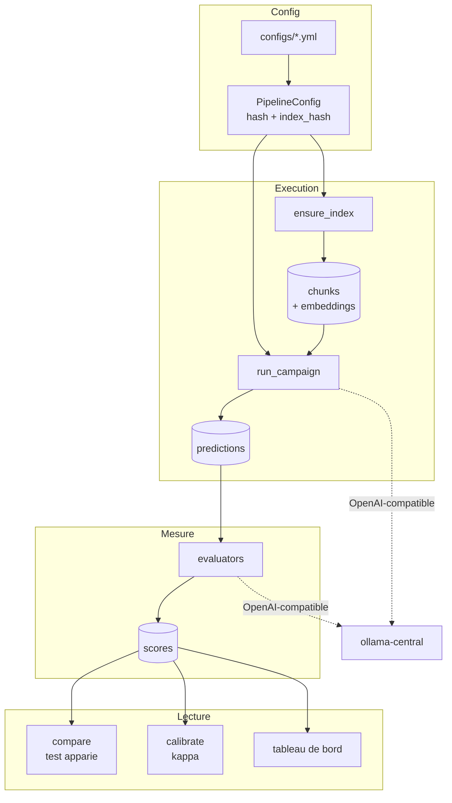
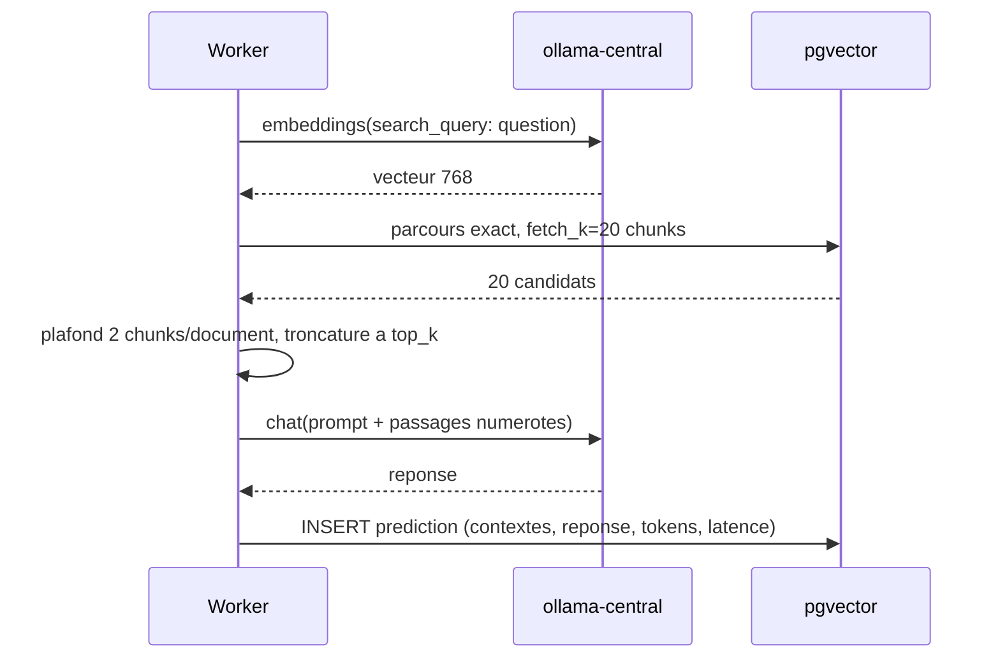

# Architecture — ragbench

Le COMMENT. Le POURQUOI est dans [CADRAGE.md](CADRAGE.md), la méthode de mesure dans
[METHODOLOGIE.md](METHODOLOGIE.md).

## 1. Vue d'ensemble

Le banc est une application Python en src-layout, adossée à PostgreSQL/pgvector pour le
stockage et à un serveur d'inférence externe pour les modèles. Elle s'utilise en ligne
de commande (`ragbench`) pour tout ce qui est long, et par un tableau de bord Streamlit
pour tout ce qui est lecture.

Le flux principal : une **configuration** YAML est hashée, exécutée sur un jeu de
questions pour produire des **prédictions**, puis ces prédictions sont notées par un ou
plusieurs **évaluateurs** qui écrivent des **scores**. Comparaison et tableau de bord ne
lisent que les scores.

La séparation exécution / évaluation est structurante : on peut rejouer une évaluation
sur d'anciens runs quand on ajoute un framework, sans reconsommer le GPU pour regénérer
les réponses.

---

## 2. Services

| Service | Image / Build | Port interne | Port hôte | Rôle |
|---|---|---|---|---|
| `db` | `pgvector/pgvector:pg17` | 5432 | **5432** | Corpus, embeddings, runs, prédictions, scores, annotations |
| `ui` | build `docker/Dockerfile` | 8501 | **8502** | Tableau de bord Streamlit |
| `runner` | build `docker/Dockerfile` | — | — | Exécution de campagnes. Profil `jobs`, pas un service permanent |
| `ollama-central` | *externe* (dépôt `llm-service`) | 11434 | 11434 | Génération, embeddings, jugement |

`ui` et `runner` partagent **la même image** : deux points d'entrée sur le même code.
Deux images divergeraient tôt ou tard, et le tableau de bord afficherait des résultats
que le runner ne saurait plus reproduire.

Le service `db` est lancé avec des réglages relevés par rapport aux valeurs par défaut de
PostgreSQL — une campagne écrit des dizaines de milliers de lignes et lit des vecteurs en
parcours exact :

```
-c shared_buffers=512MB -c work_mem=64MB -c max_parallel_workers_per_gather=4
```

Ports hôte réservés à ce projet dans `~/mes_projets/PORTS.md` : **5432** (pgvector) et
**8502** (Streamlit). Le port 11435 de l'ancienne application a été libéré.

---

## 3. Stack technologique

| Couche | Technologie | Version |
|---|---|---|
| Langage | Python | 3.12 |
| Gestion de paquets | uv | `pyproject.toml` + `uv.lock` |
| Base de données | PostgreSQL | 17.10 |
| Extension vectorielle | pgvector | 0.5.0 (client Python) |
| Accès base | psycopg | 3.3.4 |
| Client d'inférence | openai | 2.52.0 |
| Validation de configuration | pydantic | 2.13.4 |
| CLI | typer / rich | 0.27.0 / 14.3.4 |
| Interface | streamlit | 1.60.0 |
| Évaluation externe | ragas / deepeval | 0.4.3 / 4.1.5 |
| Tests | pytest | 9.1.1 |
| Lint | ruff | configuré dans `pyproject.toml` |

---

## 4. Flux de bout en bout

1. Une configuration YAML est chargée et validée en `PipelineConfig`, puis **hashée**.
2. L'index de corpus correspondant est réutilisé s'il existe, construit sinon —
   découpage, en-tête contextuel, embeddings, écriture dans `chunks`.
3. Un `run` est créé, portant ses avertissements méthodologiques figés.
4. N workers, chacun avec **sa propre connexion Postgres**, tirent les questions d'une
   file : recherche, puis génération. Les prédictions sont écrites par lots de 10.
5. Les évaluateurs sont appliqués aux prédictions dans une seconde passe et écrivent
   dans `scores`.
6. Comparaison, calibration et tableau de bord lisent `scores`.



Scénario détaillé d'une question, en mode dense avec plafond par document :



---

## 5. Réseaux, volumes et schéma

| Réseau | Services | Rôle |
|---|---|---|
| `app-network` | `db`, `ui`, `runner` | Réseau interne du projet |
| `llm-net` | `ui`, `runner` (+ `ollama-central`) | **External** — créé par `make up` dans `llm-service`. Un seul propriétaire évite les conflits de labels entre composes. |

| Volume | Monté par | Contenu |
|---|---|---|
| `pgdata` | `db` | Données PostgreSQL, persistées entre recréations |
| `./data` | `runner` | Fichiers bruts téléchargés (`data/raw/`, non versionné) |
| `./configs` | `runner` | Matrices d'expérience, versionnées |

Le schéma est dans [schema.sql](../src/ragbench/schema.sql). Trois tables portent
l'essentiel de la conception :

| Table | Clé de conception |
|---|---|
| `corpus_indexes` | Identifiée par `(dataset, index_hash)` où `index_hash = f(découpage, embedder)`. C'est ce qui évite de réindexer pour un changement de `top_k`. |
| `scores` | Porte une colonne **`evaluator`**. La même métrique notée par Ragas, par DeepEval et par un évaluateur maison donne trois lignes comparables. Mesurer leur désaccord est l'objet du projet. |
| `annotations` | Porte une colonne **`annotator`** : `human` pour l'annotation manuelle, `ground_truth` pour les valeurs dérivées des réponses gold. Les deux cohabitent et se comparent. |

Quand un juge est imposé à l'évaluation (`-o judge=…`), les scores sont stockés sous
`évaluateur@juge`. Sans cette qualification, une seconde passe avec un autre juge
écraserait la première — et on perdrait précisément l'information cherchée.

---

## 6. Décisions d'architecture

- **Accès aux modèles derrière une API OpenAI-compatible** **plutôt que** par l'API
  native de chaque moteur, **parce que** Ollama et vLLM l'exposent tous deux et que tous
  les frameworks d'évaluation acceptent un `base_url` custom : un seul point d'entrée
  suffit, sans adaptateur maison ni appel externe.
  *Limite* : l'endpoint `/v1` d'Ollama **ignore silencieusement** le champ `think` tout
  en facturant les tokens de réflexion. Mesuré sur `gemma4:e4b` : 499 tokens générés
  avec raisonnement contre 7 sans, pour la même réponse. Une échappatoire vers
  `/api/chat` est utilisée **uniquement** quand une configuration règle explicitement le
  raisonnement ([llm.py](../src/ragbench/llm.py)).

- **SQL nu plutôt qu'un ORM**, **parce que** les requêtes de recherche sont la variable
  expérimentale principale du projet : on veut pouvoir les lire et les modifier sans
  médiation. *Limite* : pas de migrations automatiques ; `schema.sql` est idempotent et
  rejoué à chaque `ragbench db init`.

- **Une connexion Postgres par worker** **plutôt qu'**une connexion partagée, **parce
  qu'**une connexion psycopg n'est pas sûre en usage entrelacé : un worker qui attend le
  LLM pendant qu'un autre exécute une requête sur la même connexion finit par corrompre
  l'état de transaction. *Limite* : quelques connexions de plus, coût négligeable devant
  celui d'un run faussé.

- **Prédictions écrites par lots au fil de l'eau** **plutôt qu'**en fin de campagne,
  **parce qu'**une campagne dure des dizaines de minutes et que tout garder en mémoire
  transforme n'importe quelle interruption en perte totale.

- **Découpage en caractères et non en tokens**, **parce qu'**un découpage en tokens
  serait lié au tokenizer d'un modèle donné, ce qui rendrait deux runs sur deux
  générateurs différents non comparables au niveau du corpus. *Repère* : environ
  4 caractères par token en anglais.

- **Fusion hybride par Reciprocal Rank Fusion** **plutôt qu'**une somme pondérée de
  scores, **parce que** le score dense (cosinus, borné à [0,1]) et le score lexical
  (`ts_rank_cd`, non borné) ne sont pas sur la même échelle : les additionner
  laisserait l'échelle décider du poids. RRF ne regarde que les rangs, donc rien à
  calibrer.

- **Plugins d'évaluation en tolérance de panne** : un framework dont l'import échoue est
  désactivé avec sa raison dans `ragbench eval list`, jamais fatal. **Parce que** leurs
  contraintes de version entrent régulièrement en conflit — exiger qu'elles soient
  toutes satisfaites rendrait le banc ininstallable. Cas réel : Ragas importe
  `langchain_community.chat_models.vertexai`, retiré à partir de langchain-community
  0.4, d'où le pin `<0.4` documenté dans `pyproject.toml`.

- **Pas d'index ANN sur les embeddings**, parcours exact. Détail et limite dans
  [CADRAGE.md](CADRAGE.md#6-décisions).

---

## 7. Sécurité

Le banc est un outil local mono-utilisateur. Il n'expose ni authentification, ni
autorisation, ni chiffrement — et n'est pas destiné à être exposé sur un réseau.

| Durcissement | État | Effet |
|---|---|---|
| Aucun appel réseau sortant à l'exécution | ✅ | Le corpus et les réponses ne quittent pas la machine |
| `.env` hors du suivi git | ✅ | Il contenait les identifiants de la base ; retiré du suivi en phase 0 |
| Secrets applicatifs | ✅ | Aucun : `LLM_API_KEY=ollama` est un jeton factice qu'Ollama ignore |
| Réseau `llm-net` en `external` | ✅ | Un seul compose propriétaire du réseau |
| Authentification sur le tableau de bord | ❌ | Streamlit sur 8502 sans mot de passe — à ne pas exposer hors de la machine |
| Mot de passe Postgres | ❌ | `postgres`/`postgres` par défaut dans `.env.example` — acceptable en local, à changer pour tout autre usage |
| Télémétrie DeepEval | à confirmer | DeepEval écrit `.deepeval/` avec un fichier de télémétrie. Répertoire ignoré par git ; le comportement réseau n'a pas été audité. |

Le seul flux sortant identifié est le **téléchargement des corpus** depuis Hugging Face,
opération explicite et ponctuelle (`curl` documenté dans le README), pas un appel
automatique.

---

## 8. Limites connues & pistes

| Aspect | Limitation / État | Recommandation |
|---|---|---|
| Recherche vectorielle | Parcours exact, sans index ANN | Tient jusqu'à ~10⁵ chunks. Au-delà, ajouter un index HNSW par dimension et mesurer la perte de recall induite |
| Boucle d'événements | Les appels Postgres sont synchrones dans des workers async ; ils bloquent brièvement la boucle | Sans effet à cette échelle (~30-80 ms). Passer à `psycopg.AsyncConnection` si le corpus grossit |
| Juges LLM | Non reproductibles, même à température 0 avec graine — voir [JUGES.md](JUGES.md) | Les métriques déterministes restent la référence. Répéter les passes de jugement pour estimer la variance |
| `native.erag` | Utilité nulle à tous les rangs sur un corpus multi-hop : la méthode suppose qu'un document seul suffise | Réserver eRAG au QA à un seul saut. `native.nuggets` répond à la même question sans cette hypothèse |
| Couverture des juges | `llama3.2:3b` ne produit aucun score pour `contextual_precision` et `contextual_recall` (schémas JSON trop profonds) | Publié avec une couverture de 0. Provisionner un juge plus capable, ou un vérificateur NLI dédié |
| Validation humaine | Aucune annotation manuelle à ce jour (`annotations` ne contient que des valeurs `ground_truth`) | Nécessaire pour valider les juges de **fidélité**, que la vérité terrain de justesse ne couvre pas |
| VRAM | 14,5 Go sur 16 en campagne avec `OLLAMA_NUM_PARALLEL=4` | Sans marge. Repasser à 2 si un autre projet a besoin du GPU simultanément |
| Observabilité | Aucune trace OpenTelemetry | Phoenix ou Langfuse en self-hosted, prévu en phase 4 |
| Lint | 17 avertissements ruff résiduels (lignes longues dans l'interface, formatage printf) | Cosmétique, non bloquant |
